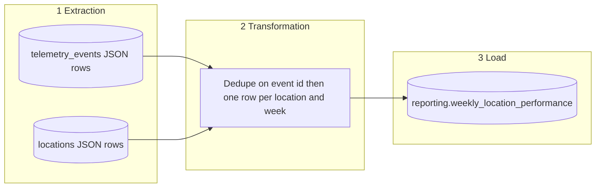

# Business Performance Data Pipeline Design

**Company:** Brasaland (14 company-owned restaurants, Colombia and Florida)
**Department needs served:** Technology (Nicolás Park — pipeline into operations and finance dashboards), Restaurant Operations (Felipe Guerrero — purchase, waste, and stockouts per location), Procurement (Lucía Fernández — purchase cost and price-alert frequency), Executive Direction (Mariana Restrepo — Monday weekly numbers she can read without calling a location)
**Audience:** Mariana Restrepo (CEO) and Felipe Guerrero (Operations Director). Lucía Fernández reads the same location-week rows for purchase cost and price alerts.
**Deliverable:** Weekly Location Cost & Waste Report
**Cadence:** Once per chain week, Monday 07:00 America/Bogota, covering the previous chain week
**Aggregation:** One row per `location_id` per chain week. Costs stay in the location currency (COP in Colombia, USD in Florida). Do not average weekly ratios into a monthly rate in this table.
**Destination table:** `reporting.weekly_location_performance`
**Source (read-only):** `telemetry_events`, plus the `locations` dimension

## Brasaland domain vocabulary

Field names and values below match the monorepo. They are not generic retail placeholders.

### Locations (`services/api/locations.py`)

`location_id` on every operational event and every `reporting.weekly_location_performance` row is one of these 14 `Location.id` values. `country` is the `Location.country` enum. `currency` is the `Location.currency` enum. Florida is `region` on the API; the pipeline stores `country`, not `region`.

| `location_id` | Name | `country` | `currency` | `region` |
| --- | --- | --- | --- | --- |
| `co-med-centro` | Medellín Centro | Colombia | COP | Colombia |
| `co-med-elpoblado` | Medellín El Poblado | Colombia | COP | Colombia |
| `co-bog-chapinero` | Bogotá Chapinero | Colombia | COP | Colombia |
| `co-bog-norte` | Bogotá Norte | Colombia | COP | Colombia |
| `co-cali-norte` | Cali Norte | Colombia | COP | Colombia |
| `co-barranquilla` | Barranquilla | Colombia | COP | Colombia |
| `co-cartagena` | Cartagena | Colombia | COP | Colombia |
| `co-pereira` | Pereira | Colombia | COP | Colombia |
| `us-mia-brickell` | Miami Brickell | United States | USD | Florida |
| `us-mia-downtown` | Miami Downtown | United States | USD | Florida |
| `us-orlando` | Orlando | United States | USD | Florida |
| `us-tampa` | Tampa | United States | USD | Florida |
| `us-ftlauderdale` | Fort Lauderdale | United States | USD | Florida |
| `us-jacksonville` | Jacksonville | United States | USD | Florida |

Eight Colombia ids, six Florida ids. Emitters must not use fixture labels such as `miami-downtown` or `medellin-centro`. A failed join that fills `currency` with `USD` would mislabel a COP kitchen.

### Inventory entities

| Entity | Monorepo meaning | How this pipeline sees it |
| --- | --- | --- |
| `Product` | Ingredient or supply (`product_id`, `name`, `quantity`, `unit` on `products.csv` / `GET /inventory`) | `product_id` (integer ≥ 1) may sit on the event payload; the weekly rollup does not group by product |
| `InboundOrder` | Goods received from a supplier at a location (`OrderType` `INBOUND`) | Emits `inbound_order_created` per line; `event_payload.cost` feeds `total_purchase_cost` |
| `OutboundOrder` | Kitchen consumption or transfer (`OrderType` `OUTBOUND`) | Emits `outbound_order_created`; out of this weekly table |
| `Location` | One of the 14 rows above | Join key `locations.id` = `event_payload.location_id` |
| Supplier | ~20 suppliers across the two markets (`supplier_id` like `sup_…`) | Price alerts fire when an inbound unit cost moves; counted as `ingredient_price_variance_detected` |

Waste `reason` on `stock_waste_registered` is one of `expired`, `kitchen_error`, or `theft_suspected`. Amounts stay in the location currency. The telemetry layer does not convert COP to USD.

### People and departments (`CONTEXT.md`)

| Name | Role | Why this pipeline exists for them |
| --- | --- | --- |
| Mariana Restrepo | CEO, Executive Direction | Monday 07:00 America/Bogota rollup instead of Tuesday PDFs |
| Felipe Guerrero | Restaurant Operations | Purchase, waste, stockouts per location |
| Lucía Fernández | Procurement | Purchase cost and price-alert frequency across markets |
| Nicolás Park | Technology | Engineering telemetry stays on `GET /telemetry/report`; this reporting module is separate |

This pipeline does not insert, update, or aggregate into `telemetry_events`. `telemetry_events` is the raw event log. Every new analytical table for this report lives in the `reporting` schema. The table name is `weekly_location_performance`. It is not `reporting.business_metrics` and it is not `reporting.weekly_location_metrics`.

HTTP that reads or triggers this report lives in `services/reporting/`. That module is separate from the engineering telemetry reader and from `GET /telemetry/report`. `services/reporting/` imports the orchestrator in `data/pipelines/`. `data/pipelines/` does not import `services/reporting/`.

## Where the work sits

| Path | Role in this pipeline |
| --- | --- |
| `data/raw/` | Optional landing copies of extracted events (for example a nightly CSV). Not the aggregation input and not the dashboard table. |
| `data/process/` | Reusable, side-effect-free transforms. `aggregate_location_kpis` belongs here so a test can call it without Prefect or HTTP. |
| `data/pipelines/` | Orchestration only: Prefect flow, extract, and load. Imports the transform from `data/process/`. |
| `data/eval/` | Hand-calculated location-week fixtures for roster ids (e.g. `us-mia-downtown`: purchase 1000 USD, waste 150 USD, ratio 0.15, one stockout, one price alert). |
| `services/reporting/` | `GET` the destination table and `POST` a run. No KPI arithmetic in the route. |

## Chain week

A chain week is `[Monday 00:00, next Monday 00:00)` in `America/Bogota`. The Monday 07:00 job reports the week that just closed.

Example: the job at Monday 2026-09-28 07:00 America/Bogota writes `week_start = 2026-09-21` and reads `created_at` in `[2026-09-21T05:00:00Z, 2026-09-28T05:00:00Z)`. The extract is inclusive of the start instant and exclusive of the end instant (`gte` / `lt`).

## KPIs this pipeline must produce

These five numbers are the weekly location grain of the telemetry floor. The engineering report (`events_per_day`, `error_rate_by_type`, `auth_failure_rate`) is a different reader and stays on `GET /telemetry/report`.

| KPI | Column on `reporting.weekly_location_performance` | Formula | Source `event_type` |
| --- | --- | --- | --- |
| Purchase cost | `total_purchase_cost` | Sum of `event_payload.cost` | `inbound_order_created` |
| Waste cost | `total_waste_cost` | Sum of `event_payload.cost` | `stock_waste_registered` |
| Waste ratio | `waste_ratio` | `total_waste_cost / total_purchase_cost` when purchase cost > 0, else `0`. Round to 4 decimal places | the two cost events above |
| Stockout frequency | `stockout_events_count` | Count of rows | `stock_threshold_triggered` |
| Price alert frequency | `price_alert_events_count` | Count of rows | `ingredient_price_variance_detected` |

`payload.cost` is a number in the location currency. Purchase and waste events always carry `cost`. Stockout and price-alert events omit `cost`; the transform treats a missing or non-numeric cost as `0` and only counts the row. A non-dict payload does not raise. It contributes cost `0` and no `location_id`, so the location group-by leaves it out of the rollup.

The extract filters exactly those four `event_type` values. Other telemetry (`sale_completed`, `page_view`, `user_login_succeeded`, `user_login_failed`, `api_error`, chain-scoped inventory deltas) is out of this table.

Each output row also carries:

| Column | Source |
| --- | --- |
| `location_id` | `event_payload.location_id` — must equal a `Location.id` from the roster (e.g. `co-med-centro`, `us-mia-downtown`) |
| `week_start` | Chain-week start date passed into the run (`YYYY-MM-DD`) |
| `country` | Left join to `locations.id`. Values are `Colombia` or `United States`. Unmatched location → `Unknown` |
| `currency` | Left join to `locations`. Values are `COP` or `USD`. Unmatched location → `USD` only as a documented fallback; emitters must send a roster id so a Colombia location is not labeled USD |

Primary key: `(location_id, week_start)`.

Colombia locations (`co-*`) stay in COP. United States / Florida locations (`us-*`) stay in USD. A chain total is two native sums. This table does not store a converted USD rollup.

## Phase 1 — Current State

### Current State

Brasaland Digital already has an engineering telemetry path. It is a platform-health report for Nicolás Park’s team. It is not the Monday purchasing report Mariana Restrepo, Felipe Guerrero, and Lucía Fernández need.

#### What we already have

| Piece | Where it lives | What it does |
| --- | --- | --- |
| Metric functions | `skills/data-analysis/scripts/pandas_clean.py` | `get_events_per_day`, `get_error_rate_by_type`, `get_auth_failure_rate` |
| Report endpoint | `skills/data-analysis/scripts/services/telemetry/main.py` | `GET /telemetry/report` reads `telemetry_events` and returns those three metrics |
| Engineering dashboard | `uis/backoffice/legacy/telemetry.html` | Three tables: traffic volume, system errors by type, authentication failure rate. It calls `GET /telemetry/report` |
| Cache | In-memory map on the report process | 60 seconds per `(start_date, end_date)`. If the query omits dates, the window is the last 7 days UTC |

The reader selects only `id`, `timestamp`, `event_type`, and `tags`. The JSON body is `{ period: { from, to }, metrics }`. It has no `location_id`, no `currency`, and no `cost`.

#### Telemetry events captured so far

Engineering events the technical report is written against:

| `event_type` | What it records | Which engineering metric uses it |
| --- | --- | --- |
| `user_login_succeeded` | A staff sign-in that succeeded | Daily volume, and the denominator of the auth failure rate |
| `user_login_failed` | A staff sign-in that failed | Daily volume, error counts, and the numerator of the auth failure rate |
| `api_error` | A technical API failure | Daily volume and error counts by type |

`get_events_per_day` counts every row in the window, so any other stored type still adds to daily traffic. The named error and auth metrics only branch on the three types above.

Operational events already defined for kitchens and suppliers. `GET /telemetry/report` does not aggregate them. They are the mandatory inputs for the five location-week KPIs:

| `event_type` | Fires when | KPI it feeds |
| --- | --- | --- |
| `inbound_order_created` | An `InboundOrder` line (`OrderType` `INBOUND`) is committed at a location | Purchase cost (`event_payload.cost`) |
| `stock_waste_registered` | Waste is logged; `reason` is `expired`, `kitchen_error`, or `theft_suspected` | Waste cost (`event_payload.cost`) |
| `stock_threshold_triggered` | Stock for a `Product` falls below the configured minimum at a location | Stockout frequency (row count) |
| `ingredient_price_variance_detected` | An inbound unit cost for a `Product` / supplier jumps versus history | Price-alert frequency (row count) |
| `outbound_order_created` | An `OutboundOrder` line (`OrderType` `OUTBOUND`) is committed | None. Out of this weekly table |
| `direct_stock_edit_rejected` | A direct stock edit is blocked (stock changes only via inbound/outbound orders) | None. Out of this weekly table |

Purchase, waste, stockout, and price-alert events carry `location_id` (a roster id such as `co-med-centro` or `us-mia-downtown`), `country` (`Colombia` or `United States`), `product_id` (integer inventory id), `quantity`, `unit`, and `currency` (`COP` or `USD`). Waste also carries `reason`. Amounts stay in the location currency. The telemetry layer does not convert COP to USD.

#### Where they are stored

Every captured event, engineering or operational, is one row in the Supabase table `telemetry_events`. The engineering reader filters that table with `timestamp >= start` and `timestamp < end`. `GET /telemetry/report` reads `telemetry_events` and returns the three engineering metrics. It does not write a second table. It does not write `reporting.weekly_location_performance`.

A nightly export (`scripts/nightly_export.py`) can copy a subset of those rows (`inbound_order_created`, `stock_waste_registered`, `stock_threshold_triggered`) into a CSV under the raw landing area. That CSV is a copy of events. It is not the dashboard table and it is not an aggregation.

#### What the technical report already answers for engineering

`GET /telemetry/report` answers three engineering questions, and only these:

1. **Traffic.** How many events hit the platform each UTC day? Formula: count of `id`, grouped by date (`events_per_day`).
2. **Failures.** Which technical failures showed up in the window? Formula: count of `api_error` and `user_login_failed`, grouped by `event_type` (`error_rate_by_type`).
3. **Sign-in health.** What share of login attempts failed each day? Formula: `user_login_failed / (user_login_failed + user_login_succeeded)`, rounded to 4 decimal places (`auth_failure_rate`).

`uis/backoffice/legacy/telemetry.html` renders those three tables. That is enough for Nicolás Park to see load, instability, and authentication trouble. It says nothing about a kitchen’s purchases, waste, stockouts, or supplier price moves.

### Business Gap

`CONTEXT.md` still has a purchasing question the technical report cannot answer.

Restaurant Operations (`CONTEXT.md`): “Ingredient orders are placed by WhatsApp or phone, resulting in overstock in some locations and stockouts in others.” Felipe Guerrero has no per-location view of what a kitchen bought or threw away.

Procurement (`CONTEXT.md`): “Lucía finds out about raw material price changes when the invoice arrives. There is no consolidated purchasing data across the chain.” She needs price alerts and purchasing visibility across Colombia and Florida.

Executive Direction (`CONTEXT.md`): weekly PDFs arrive on Tuesday. Mariana Restrepo needs a report every Monday at 7am. The engineering dashboard is not that report.

The unanswered question this pipeline exists to answer:

**For each of the 14 locations, in the chain week that just closed, what was the purchase cost, the waste cost, the waste ratio, the stockout frequency, and the price-alert frequency, in that location’s own currency (COP or USD)?**

`GET /telemetry/report` cannot answer it. Its select list never reads `cost` or `location_id`, and its three metrics never group `inbound_order_created`, `stock_waste_registered`, `stock_threshold_triggered`, or `ingredient_price_variance_detected`. Counting those rows inside `events_per_day` only increases a platform traffic total. It does not produce a location-week cost.

That question needs a dedicated pipeline: read those four event types for one chain week, join `locations` for country and currency, aggregate one row per location, and load `reporting.weekly_location_performance`. The engineering endpoint stays the engineering endpoint. Sales questions in `CONTEXT.md` (covers today at Medellín Centro, a slow week at the Miami restaurant, Florida week sales, highest average ticket) are a different grain and are not this table.

## Phase 2 — Pipeline design

### Purpose

This pipeline produces the Weekly Location Cost & Waste roll-up in `reporting.weekly_location_performance` that feeds Mariana Restrepo’s executive report, read with Felipe Guerrero and Lucía Fernández, every Monday at 07:00 America/Bogota.

### Business deliverable

The deliverable is that Monday roll-up: one row per Brasaland location for the chain week that just closed (`[Monday 00:00, next Monday 00:00)` in `America/Bogota`). Costs stay in the location currency (COP in Colombia, USD in Florida). The row is what the Monday 07:00 report reads. It is not a row in `telemetry_events`, and it is not a metric on `GET /telemetry/report`.

### KPIs it computes

These are the five numbers in the KPIs this pipeline must produce. Each is one column on `reporting.weekly_location_performance`.

| KPI | Column | Formula | Source `event_type` |
| --- | --- | --- | --- |
| Purchase cost | `total_purchase_cost` | Sum of `event_payload.cost` | `inbound_order_created` |
| Waste cost | `total_waste_cost` | Sum of `event_payload.cost` | `stock_waste_registered` |
| Waste ratio | `waste_ratio` | `total_waste_cost / total_purchase_cost` when purchase cost > 0, else `0`, rounded to 4 decimal places | the two cost events |
| Stockout frequency | `stockout_events_count` | Count of rows | `stock_threshold_triggered` |
| Price alert frequency | `price_alert_events_count` | Count of rows | `ingredient_price_variance_detected` |

### Extraction format

The source is `telemetry_events`, plus the existing `locations` domain table. Both are read from Supabase as a JSON array of row objects (PostgREST). The pipeline keeps that JSON only for the run. It writes the roll-up to `reporting.weekly_location_performance`.

| Source | Why it is read | Format the data arrives in | How often it is updated |
| --- | --- | --- | --- |
| `telemetry_events` | Facts for the five KPIs | One JSON object per event. Columns used: `id` (UUID), `event_type`, `created_at`, `event_payload` (JSON). `event_payload.location_id` is a roster id such as `co-bog-norte` or `us-orlando`. Cost events also carry `event_payload.cost` as a number in that location’s `COP` or `USD` | Continuously, as each kitchen acts. A new receipt, waste log, stockout, or price jump is an insert. A correction of a receipt **updates the existing row** (same `id`, new `cost`). It does not insert a second event. |
| `locations` | Country and currency for the 14 sites | One JSON object per site, the same shape as `GET /locations`: `id`, `country` (`Colombia` or `United States`), `currency` (`COP` or `USD`) | When a location record is edited. The same `id` is updated in place. The table is 14 rows. |

The extract for `telemetry_events` is one chain-week snapshot: `event_type` in `inbound_order_created`, `stock_waste_registered`, `stock_threshold_triggered`, `ingredient_price_variance_detected`, and `created_at >= window_start` and `created_at < window_end`. `locations` is read in full. Both snapshots are taken when the job runs: Monday 07:00 America/Bogota for the previous chain week, or when `POST /reporting/pipeline-runs` asks for a window. The pipeline does not tail the tables between those runs.

### Data flow

Extraction, transformation, and load are three separate stages. Extraction only reads. Transformation only computes a frame. Load only writes that frame.

1. **Extraction.** `extract_telemetry_events` and `extract_domain_data` in `data/pipelines/pipeline.py` pull the two JSON snapshots for the requested window. They do not sum costs.
2. **Transformation.** `aggregate_location_kpis` in `data/process/` drops duplicate event `id`s, reads `location_id` and `cost` from `event_payload`, sums and counts by location, joins `locations`, and emits one row per `location_id` with `week_start` set to the chain-week start. It does not write to Supabase.
3. **Load.** `upsert_to_reporting_table` writes those rows to `reporting.weekly_location_performance`. It does not re-read `telemetry_events`.

`GET /telemetry/report` stays on its own reader. It is not one of these three stages.

### Source rows that are updated, and how duplicates are avoided

`telemetry_events` does not only insert. A corrected supplier receipt keeps `telemetry_events.id` and changes `event_payload.cost` on that same row. `locations.id` is the same kind of key: an edit changes `country` or `currency` on the existing site row.

An append-only strategy would treat the corrected receipt as new money and add it to the cost already stored for the week. This pipeline does not do that. Every run is a fresh snapshot of the current rows for the whole chain week. It does not keep a high-water mark of inserts since the last run, and it does not add this run’s costs onto the costs already stored for that week.

Concrete case. Week `2026-09-21`, location `us-mia-downtown`. Event `id` `3f2a` is `inbound_order_created` with `cost` 1000 USD. The supplier later corrects the receipt: the same `id` `3f2a` now has `cost` 1200 USD. There is still one source row.

| Step | What happens to `3f2a` | Purchase cost for `us-mia-downtown` / `2026-09-21` |
| --- | --- | --- |
| Extract | The week snapshot contains `3f2a` once, with `cost` 1200. The old 1000 is gone because the row was updated, not copied. | — |
| If the JSON lists `3f2a` twice | Drop duplicates on `id` before any sum, keeping one copy. | The 1200 is not added to itself. |
| Transform | Sum `cost` on the remaining `inbound_order_created` rows. | `total_purchase_cost` = 1200, not 1000 + 1200. |
| Load | `INSERT ... ON CONFLICT (location_id, week_start) DO UPDATE` sets `total_purchase_cost = EXCLUDED.total_purchase_cost`. | The existing location-week row is replaced with 1200. A second Monday run does not insert another row and does not add 1200 to the stored total. |

The same three rules apply to waste cost, stockout count, and price-alert count: dedupe on `telemetry_events.id`, recompute the week from that snapshot, then replace the destination key `(location_id, week_start)`. The conflict clause assigns the new total. It is not `total_purchase_cost = weekly_location_performance.total_purchase_cost + EXCLUDED.total_purchase_cost`.

`locations` uses the same snapshot rule. The join reads the site row as it exists at extract time, and the upsert writes that `country` and `currency` onto the existing location-week key.

## Phase 3 — Resilience and idempotency

### Idempotency when load fails and the job is rerun

The grain of `reporting.weekly_location_performance` is one row per `(location_id, week_start)`. That pair is the primary key.

If the load dies after some rows are written (dropped connection, statement timeout, process kill), those rows already hold the full recomputed week. The rows not yet written still hold the previous successful week, or they are absent. The rerun must replace both groups with the same full-week figures. It must not add the new totals onto the rows that already landed.

The guarantee has three steps, in this order:

1. **Recompute the whole chain week before any write.** Transformation reads the current `telemetry_events` snapshot, dedupes on `id`, and builds a complete frame. Each output row already contains the final `total_purchase_cost`, `total_waste_cost`, `waste_ratio`, `stockout_events_count`, and `price_alert_events_count` for that location and week. The load never sends a delta.
2. **Replace the key, including rows loaded before the crash.** Load is one upsert: `INSERT INTO reporting.weekly_location_performance ... ON CONFLICT (location_id, week_start) DO UPDATE SET` every KPI column, `country`, and `currency` to the excluded values (`on_conflict=location_id,week_start`). A location-week that was written in the failed attempt is overwritten with those same totals. A location-week that never landed is inserted. The primary key blocks a second row for the same location and week.
3. **The update assigns the new total. It does not add.** The conflict clause is `total_purchase_cost = EXCLUDED.total_purchase_cost` (and the same assignment for waste cost, waste ratio, stockout count, and price-alert count). It is not `total_purchase_cost = weekly_location_performance.total_purchase_cost + EXCLUDED.total_purchase_cost`. A second run after a partial load therefore leaves one row per location, with the recomputed week, which is the same number a single successful load would have written.

A rerun uses the same `window_start` and `window_end` as the failed attempt, recorded on that attempt’s log row. The Monday job and `POST /reporting/pipeline-runs` both pass that pair through to the flow.

### Execution log

Every attempt appends one row to `reporting.pipeline_runs` and mirrors the latest row in `data/pipelines/last_run.json` for `GET /reporting/pipeline-runs/latest`. The row is inserted with `status = Running` and `started_at` when the flow begins. It is updated when the flow finishes or when load raises. A failed load and the rerun that follows are two rows, so production can see both.

Minimum fields on every run (name, data type, and production justification):

| Field | Data type | What is recorded | Why production needs it |
| --- | --- | --- | --- |
| `started_at` | `timestamptz` (UTC) | Instant when this attempt began | Shows whether the Monday 07:00 America/Bogota job actually started, and how long the gap was after the previous success. A missing start means the scheduler never fired. |
| `finished_at` | `timestamptz` (UTC), nullable | Instant when this attempt ended, success or failure | With `started_at`, gives duration. A run that has `started_at` and a null `finished_at` is still in load or died without closing the log. That is the row to rerun. |
| `records_processed` | `integer` | Count of `telemetry_events` rows in the deduped extract for the window | Tells an auditor whether the week had events. A sudden zero against a normally busy week means the extract missed the window or the source was empty. A count that matches the prior success, with the same KPI totals, confirms the rerun replaced rows instead of stacking them. |
| `status` | `text` (`Running` \| `Success` \| `Failed`) | Outcome of this attempt | Separates a finished week from a load that stopped halfway. `Failed` is the signal to rerun that window. `Success` means every location-week key from the frame was upserted. A location with zero waste can still be `Success`. |
| `error_message` | `text`, nullable | Public failure text when `status` is `Failed`; null on success | Names the load failure (timeout, connection drop) so the rerun is aimed at the broken stage. The text stays free of connection strings, keys, and host paths. |

`window_start` and `window_end` are stored on the same row so the rerun passes the identical chain week. `run_id` distinguishes the failed attempt from the retry in the audit list.

## Phase 4 — Mapping to Prefect

Part 1 is one main flow and three tasks. A second flow for backfill is optional here. Part 3 is where extract, transform, and load become their own subflows.

### Main flow

| Prefect concept | Brasaland object |
| --- | --- |
| Flow | `brasaland_weekly_performance_pipeline` (`run_pipeline(start_date, end_date)` in `data/pipelines/pipeline.py`) |
| Parameters | `start_date`, `end_date`: the chain-week bounds passed to extract and stored on the run log |
| Schedule | Deployment cron Monday 07:00 America/Bogota. The parameters are the previous chain week. |
| What it does | Calls extract, then transform, then load, in that order. Writes `reporting.pipeline_runs` around the call. |

### Tasks

| Task | Stage | What it does |
| --- | --- | --- |
| `extract_weekly_inputs` | Extract | Reads the JSON snapshots: `telemetry_events` for the four KPI event types in the window, and `locations` (`id`, `country`, `currency`). Returns both frames. Retries on a store timeout. |
| `aggregate_location_kpis` | Transform | Dedupes on event `id`, sums purchase and waste cost, counts stockouts and price alerts, joins `locations`, and returns one row per `location_id` for `week_start`. No database write. |
| `upsert_to_reporting_table` | Load | Upserts that frame into `reporting.weekly_location_performance` on `(location_id, week_start)`, assigning the recomputed totals. Retries on a store timeout. |

`extract_telemetry_events` and `extract_domain_data` are the two reads inside the extract task. They stay in this one task until Part 3 splits the stages into subflows.

### States

Prefect state on the flow is what operators see. The same outcome is copied to `reporting.pipeline_runs.status`.

| Prefect state | When it applies | Run log |
| --- | --- | --- |
| `Running` | The flow has started and extract, transform, or load is still in progress | `Running`, `started_at` set, `finished_at` empty |
| `Completed` | Load upsert finished for every row in the frame | `Success`, `finished_at` set, `records_processed` set |
| `Failed` | Extract or load raised after its retries, or transform raised | `Failed`, `finished_at` set, `error_message` set. The rerun uses the same window and the Phase 3 upsert. |

`Scheduled` is only the deployment waiting for Monday 07:00. It is not a run-log status.

### Optional second flow

`brasaland_weekly_backfill_flow(weeks)` is optional in Part 1. It would call the same three tasks once per chain week (a missed Monday, or a receipt corrected after the report). It does not define new KPI rules. Part 1 ships the Monday flow only. Part 3 splits extract, transform, and load into subflows; the backfill flow would call those subflows per week.

### Prefect blocks

The Supabase connection is a Prefect block, not a value in `data/pipelines/`.

| Block | Type | What it holds |
| --- | --- | --- |
| `brasaland-supabase` | Secret block, or a credentials block with a URL and a key | `SUPABASE_URL` and `SUPABASE_KEY` for the project that stores `telemetry_events`, `locations`, and `reporting.weekly_location_performance` |

The flow loads `brasaland-supabase` at the start of extract and load. Local runs may read the same two names from `.env` when the block is absent. The URL and the key are never written into the repository or into this document.

## Phase 5 — Application integration

Design only. `services/reporting/` is an HTTP shell. Every route imports a function or flow from `data/pipelines/`. No extract, no transform, and no load code belongs in `services/`. Part 3’s dashboard consumes the KPI query only.

### Module boundary

| Layer | Owns | Does not own |
| --- | --- | --- |
| `services/reporting/main.py` | HTTP status codes, request validation, JSON response shape | Summing `cost`, filtering event types, joining `locations`, upserting KPIs |
| `data/pipelines/pipeline.py` | `run_pipeline` flow; read helpers that query the reporting schema or the run log | FastAPI routes |

`services/reporting/` imports from `data/pipelines/`. `data/pipelines/` does not import `services/reporting/`.

This module is not `services/telemetry/`. It does not mount `GET /telemetry/report`.

### Three endpoints

| Role | Endpoint | Request | Response | Calls in `data/pipelines/` |
| --- | --- | --- | --- | --- |
| Status | `GET /reporting/pipeline-runs/latest` | None | Latest run: `started_at`, `finished_at`, `window_start`, `window_end`, `records_processed`, `status`, `error_message` | `get_latest_pipeline_run()` — returns the newest `reporting.pipeline_runs` row (mirrored in `data/pipelines/last_run.json`). No ETL. |
| Manual trigger | `POST /reporting/pipeline-runs` | Body `{ "start_date": "...", "end_date": "..." }` | `202` with `{ "task_id": "..." }` | Enqueues `run_pipeline(start_date, end_date)` — the Prefect flow `brasaland_weekly_performance_pipeline`. The worker runs extract, transform, and load. The route does not call those tasks itself. |
| KPI query | `GET /reporting/weekly-location-performance` | Optional query `week_start` | `{ "week_start": "2026-09-21", "locations": [ { "location_id": "co-med-centro", "country": "Colombia", "currency": "COP", "total_purchase_cost": 18500000, "total_waste_cost": 920000, "waste_ratio": 0.0497, "stockout_events_count": 2, "price_alert_events_count": 1 }, { "location_id": "us-mia-downtown", "country": "United States", "currency": "USD", "total_purchase_cost": 1000, "total_waste_cost": 150, "waste_ratio": 0.15, "stockout_events_count": 1, "price_alert_events_count": 1 } ] }` | `get_weekly_location_performance(week_start=None)` — `SELECT` from `reporting.weekly_location_performance` only. Part 3’s dashboard consumes this payload for Mariana Restrepo and Felipe Guerrero. No ETL. |

`GET /tasks/{task_id}` may sit beside the manual trigger so the client can poll the Celery enqueue until `run_pipeline` finishes. It is not one of the three business endpoints and it does not run ETL.

### What each call does, and what it must not do

1. **Status — `get_latest_pipeline_run()`.** Reads the run log written by `run_pipeline`. Answers whether the Monday job (or the last manual trigger) is `Running`, `Success`, or `Failed`. Does not open `telemetry_events`.
2. **Manual trigger — `run_pipeline(start_date, end_date)`.** The only path that starts extract → transform → load. `services/reporting/` passes the window and returns `202`. It does not sum purchase cost, count stockouts, or upsert rows.
3. **KPI query — `get_weekly_location_performance(week_start)`.** Reads the destination table after a successful load. That is the feed Part 3’s dashboard will consume for Mariana Restrepo and Felipe Guerrero (and Lucía Fernández for purchase cost and price alerts). It does not recompute waste ratio from events.

### Separate from telemetry

| Surface | Module | Table | Audience |
| --- | --- | --- | --- |
| `GET /telemetry/report` | Telemetry report code (`services/telemetry/` path in the engineering stack) | `telemetry_events` | Nicolás Park — traffic, error types, auth failure rate |
| `GET /reporting/pipeline-runs/latest`, `POST /reporting/pipeline-runs`, `GET /reporting/weekly-location-performance` | `services/reporting/` | `reporting.pipeline_runs` and `reporting.weekly_location_performance` | Mariana Restrepo, Felipe Guerrero, Lucía Fernández — run status and location-week KPIs |

This design does not modify `services/telemetry/analysis.py` or `GET /telemetry/report`. Those remain the engineering path. The reporting routes do not read or write `telemetry_events`. `GET /telemetry/report` does not read `reporting.weekly_location_performance`.
