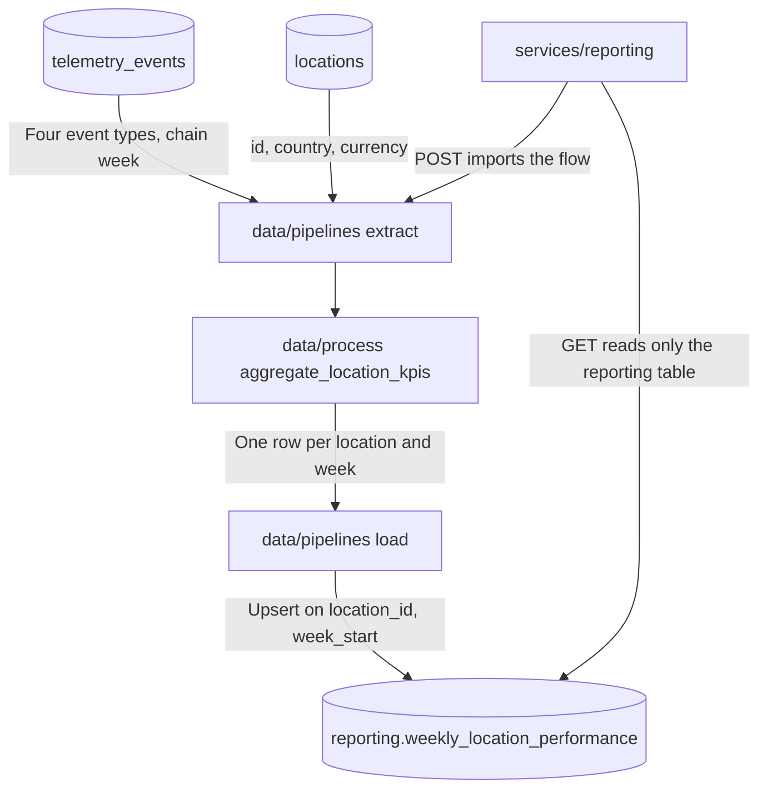

# Business Performance Data Pipeline Design

**Company:** Brasaland (14 company-owned restaurants, Colombia and Florida)
**Department needs served:** Technology (Nicolás Park — pipeline into operations and finance dashboards), Restaurant Operations (Felipe Guerrero — purchase, waste, and stockouts per location), Procurement (Lucía Fernández — purchase cost and price-alert frequency), Executive Direction (Mariana Restrepo — Monday weekly numbers she can read without calling a location)
**Audience:** Mariana Restrepo (CEO) and Felipe Guerrero (Operations Director). Lucía Fernández reads the same location-week rows for purchase cost and price alerts.
**Deliverable:** Weekly Location Cost & Waste Report
**Cadence:** Once per chain week, Monday 07:00 America/Bogota, covering the previous chain week
**Aggregation:** One row per `location_id` per chain week. Costs stay in the location currency (COP in Colombia, USD in Florida). Do not average weekly ratios into a monthly rate in this table.
**Destination table:** `reporting.weekly_location_performance`
**Source (read-only):** `telemetry_events`, plus the `locations` dimension

This pipeline does not insert, update, or aggregate into `telemetry_events`. `telemetry_events` is the raw event log. Every new analytical table for this report lives in the `reporting` schema. The table name is `weekly_location_performance`. It is not `reporting.business_metrics` and it is not `reporting.weekly_location_metrics`.

HTTP that reads or triggers this report lives in `services/reporting/`. That module is separate from the engineering telemetry reader and from `GET /telemetry/report`. `services/reporting/` imports the orchestrator in `data/pipelines/`. `data/pipelines/` does not import `services/reporting/`.

## Where the work sits

| Path | Role in this pipeline |
| --- | --- |
| `data/raw/` | Optional landing copies of extracted events (for example a nightly CSV). Not the aggregation input and not the dashboard table. |
| `data/process/` | Reusable, side-effect-free transforms. `aggregate_location_kpis` belongs here so a test can call it without Prefect or HTTP. |
| `data/pipelines/` | Orchestration only: Prefect flow, extract, and load. Imports the transform from `data/process/`. |
| `data/eval/` | Hand-calculated location-week fixtures (purchase 1000, waste 150, ratio 0.15, one stockout, one price alert). |
| `services/reporting/` | `GET` the destination table and `POST` a run. No KPI arithmetic in the route. |

## Chain week

A chain week is `[Monday 00:00, next Monday 00:00)` in `America/Bogota`. The Monday 07:00 job reports the week that just closed.

Example: the job at Monday 2026-09-28 07:00 America/Bogota writes `week_start = 2026-09-21` and reads `created_at` in `[2026-09-21T05:00:00Z, 2026-09-28T05:00:00Z)`. The extract is inclusive of the start instant and exclusive of the end instant (`gte` / `lt`).

## KPIs this pipeline must produce

These five numbers are the weekly location grain of the telemetry floor. The engineering report (`events_per_day`, `error_rate_by_type`, `auth_failure_rate`) is a different reader and stays on `GET /telemetry/report`.

| KPI | Column on `reporting.weekly_location_performance` | Formula | Source `event_type` |
| --- | --- | --- | --- |
| Purchase cost | `total_purchase_cost` | Sum of `event_payload.cost` | `inbound_order_created` |
| Waste cost | `total_waste_cost` | Sum of `event_payload.cost` | `stock_waste_registered` |
| Waste ratio | `waste_ratio` | `total_waste_cost / total_purchase_cost` when purchase cost > 0, else `0`. Round to 4 decimal places | the two cost events above |
| Stockout frequency | `stockout_events_count` | Count of rows | `stock_threshold_triggered` |
| Price alert frequency | `price_alert_events_count` | Count of rows | `ingredient_price_variance_detected` |

`payload.cost` is a number in the location currency. Purchase and waste events always carry `cost`. Stockout and price-alert events omit `cost`; the transform treats a missing or non-numeric cost as `0` and only counts the row. A non-dict payload does not raise. It contributes cost `0` and no `location_id`, so the location group-by leaves it out of the rollup.

The extract filters exactly those four `event_type` values. Other telemetry (`sale_completed`, `page_view`, `user_login_succeeded`, `user_login_failed`, `api_error`, chain-scoped inventory deltas) is out of this table.

Each output row also carries:

| Column | Source |
| --- | --- |
| `location_id` | `event_payload.location_id` |
| `week_start` | Chain-week start date passed into the run (`YYYY-MM-DD`) |
| `country` | Left join to `locations.id`. Unmatched location → `Unknown` |
| `currency` | Left join to `locations`. Unmatched location → `USD` only as a documented fallback; emitters must send a roster id so a Colombia location is not labeled USD |

Primary key: `(location_id, week_start)`.

Colombia locations stay in COP. Florida locations stay in USD. A chain total is two native sums. This table does not store a converted USD rollup.

## Phase 1 — Current state analysis

### Current state

Brasaland Digital already has an engineering telemetry path. It is a platform health report for Nicolás Park’s team, built before this business pipeline.

What is already in the repo:

| Piece | Where it lives | What it does |
| --- | --- | --- |
| Metric functions | `skills/data-analysis/scripts/pandas_clean.py` | `get_events_per_day`, `get_error_rate_by_type`, `get_auth_failure_rate` |
| Report endpoint | `skills/data-analysis/scripts/services/telemetry/main.py` | `GET /telemetry/report` |
| Engineering dashboard | `uis/backoffice/legacy/telemetry.html` | Renders traffic, errors, and authentication for the last window |
| Cache | In-memory map on the report process | 60 seconds per `(start_date, end_date)`. Default window is the last 7 days UTC when the query omits dates |

The report selects `id`, `timestamp`, `event_type`, and `tags`. It returns `{ period: { from, to }, metrics }`. It has no location, currency, or cost fields.

### Telemetry events captured so far

The technical report is written against these `event_type` values already stored for engineering:

| `event_type` | What it records | Which engineering metric uses it |
| --- | --- | --- |
| `user_login_succeeded` | A staff sign-in that succeeded | Daily volume, and the denominator of the auth failure rate |
| `user_login_failed` | A staff sign-in that failed | Daily volume, error counts, and the numerator of the auth failure rate |
| `api_error` | A technical API failure | Daily volume and error counts by type |

`get_events_per_day` counts every row in the window, so any other stored type still adds to daily traffic. The named metrics above only branch on the three types in the table.

The telemetry contract for the inventory system also names six mandatory business events. They are the raw material for operations and procurement. The engineering report does not aggregate them:

| `event_type` | Fires when |
| --- | --- |
| `inbound_order_created` | A location registers a supplier arrival |
| `outbound_order_created` | A location registers prep consumption |
| `stock_waste_registered` | Waste is logged (`expired`, `kitchen_error`, or `theft_suspected`) |
| `stock_threshold_triggered` | Stock falls below the configured minimum |
| `direct_stock_edit_rejected` | A direct stock edit is blocked |
| `ingredient_price_variance_detected` | An inbound unit cost jumps versus history |

Those events carry `location_id`, `country` (`CO` or `US`), `product_id`, `quantity`, `unit`, and `currency` (`COP` or `USD`). Waste also carries `reason`. Amounts stay in the location currency.

### Where they are stored

Every captured event is one row in the Supabase table `telemetry_events`. The engineering reader filters that table with `timestamp >= start` and `timestamp < end`. There is no reporting schema and no location-week table on this path. `GET /telemetry/report` reads `telemetry_events` and returns the three engineering metrics. It does not write a second table.

### What the technical report already answers for engineering

`GET /telemetry/report` answers three engineering questions:

1. **Traffic.** How many events hit the platform each UTC day? Formula: count of `id`, grouped by date (`events_per_day`).
2. **Failures.** Which technical failures showed up in the window? Formula: count of `api_error` and `user_login_failed`, grouped by `event_type` (`error_rate_by_type`).
3. **Sign-in health.** What share of login attempts failed each day? Formula: `user_login_failed / (user_login_failed + user_login_succeeded)`, rounded to 4 decimal places (`auth_failure_rate`).

The dashboard at `uis/backoffice/legacy/telemetry.html` shows those three tables and nothing else. That is enough for Nicolás to see load, instability, and authentication trouble.

### The gap

The technical report leaves this business question unanswered:

**For each of the 14 locations, in this chain week, what was the purchase cost, the waste cost, the waste ratio, the stockout frequency, and the price-alert frequency, in that location’s own currency (COP or USD)?**

That is the question Felipe Guerrero needs when a kitchen is wasting food or stocking out, the question Lucía Fernández needs when a supplier price moves before the invoice arrives, and the question Mariana Restrepo cannot answer from Tuesday PDFs or from a platform-health chart. `GET /telemetry/report` cannot answer it: its metrics never read `cost` or `location_id`, and they never group `inbound_order_created`, `stock_waste_registered`, `stock_threshold_triggered`, or `ingredient_price_variance_detected`.

Answering it needs a dedicated pipeline: read those events for one chain week, join `locations` for country and currency, aggregate one row per location, and load `reporting.weekly_location_performance`. The engineering endpoint stays the engineering endpoint.

## Phase 2 — Pipeline design

### Purpose

Produce the Weekly Location Cost & Waste Report: purchase cost, waste cost, waste ratio, stockout frequency, and price alert frequency for each location and chain week.

### Extraction

1. Read `telemetry_events` for the chain-week window and the four event types. Columns used: `event_type`, `event_payload`, `created_at`.
2. Read `locations` for `id`, `country`, `currency` (the 14 Brasaland sites).
3. Pass both frames to the transform in `data/process/`. The flow does not parse KPI rules inline.

### Flow

`services/telemetry` and `GET /telemetry/report` are not on this path.

## Phase 3 — Resilience and idempotency

### Idempotency

The transform recomputes the whole window from `telemetry_events` on every run. The load is `INSERT ... ON CONFLICT (location_id, week_start) DO UPDATE` (Supabase `upsert` with `on_conflict=location_id,week_start`). A retry after a dropped connection overwrites the same keys. It does not add to `total_purchase_cost` or insert a second row for the same location and week.

An empty extract writes nothing and does not delete rows already stored for that week. A week that truly has events replaces those location keys with the newly computed totals.

### Run log

Each attempt appends a row to `reporting.pipeline_runs` (same reporting schema, not `telemetry_events`) and mirrors the latest attempt in `data/pipelines/last_run.json` for `GET /reporting/pipeline-runs/latest`.

| Field | Why it is stored |
| --- | --- |
| `run_id` | Which attempt produced the rows Mariana is looking at |
| `window_start`, `window_end` | The chain week, so a late event can be reprocessed without guessing bounds |
| `status` | `Running`, `Success`, or `Failed`. A failed run is not the same as a location with zero waste |
| `records_processed` | Raw events read. A sudden zero against a normally busy week means the extract failed or the filter missed the window |
| `error_message` | Public failure text only (no connection strings, keys, or host paths) |

## Phase 4 — Prefect

### Mapping

| Prefect concept | Brasaland object |
| --- | --- |
| Flow | `brasaland_weekly_performance_pipeline` (`run_pipeline(start_date, end_date)` in `data/pipelines/pipeline.py`) |
| Subflows | `extract_brasaland_data_flow`, `transform_brasaland_kpis_flow`, `load_brasaland_reporting_flow` |
| Tasks | `extract_telemetry_events`, `extract_domain_data`, `aggregate_location_kpis`, `upsert_to_reporting_table` |
| Schedule | Monday 07:00 America/Bogota, parameters = previous chain week |
| Completed | Upsert into `reporting.weekly_location_performance` succeeded and the run log says `Success` |
| Failed | Extract or load error. Retries use the same window. The upsert key prevents double counting |

Extract and load tasks retry. The aggregation task is a pure function of its inputs.

### Secrets

`SUPABASE_URL` and `SUPABASE_KEY` come from the environment (local `.env`, or a Prefect Secret block in a hosted deployment). They are not written into `data/pipelines/` or into this document.

## Phase 5 — Application integration

`services/reporting/main.py` is the only HTTP surface for this table.

| Method and path | Behavior |
| --- | --- |
| `GET /reporting/weekly-location-performance` | Reads `reporting.weekly_location_performance`. Optional `week_start`. Returns `{week_start, locations[]}` with the five KPI columns plus `location_id`, `country`, and `currency`. Does not scan `telemetry_events`. |
| `POST /reporting/pipeline-runs` | Body `{start_date, end_date}`. Enqueues the flow and returns `202` with `task_id`. The route does not sum costs. |
| `GET /tasks/{task_id}` | Celery status for that enqueue. |
| `GET /reporting/pipeline-runs/latest` | Latest run log (`window`, `records_processed`, `status`). |

`POST /reporting/pipeline-runs` reaches `data.pipelines.pipeline.run_pipeline` through the worker (`services.tasks.run_weekly_pipeline`). The pipeline module does not import the FastAPI app.

`GET /telemetry/report` remains the engineering window over `telemetry_events` (events per day, error rate by type, auth failure rate). It does not return purchase cost, waste cost, waste ratio, stockout frequency, or price alert frequency.
