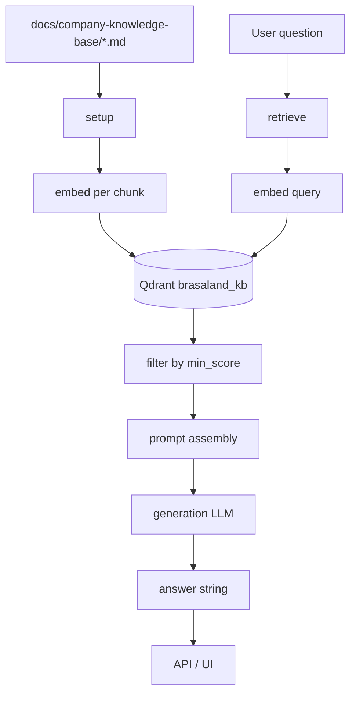

# RAG System Architecture & Design Document

**Company:** Brasaland  
**Audience:** Developers maintaining the RAG stack; commercial and operations teams (end users)

This document describes the Brasaland Retrieval-Augmented Generation (RAG) system so another developer can understand the full stack — indexing, retrieval, generation, API, and UI — without reading the source code. Implementation lives in `data/process/rag.py` (indexing), `data/pipelines/rag.py` (retrieve + query), and `CONTEXT-company.md` (domain constraints).

---

## 1. End-to-end RAG process

### Numbered flow

1. **Source documents** — Four Markdown policy files in `docs/company-knowledge-base/` (listed in `CONTEXT-company.md`).
2. **`setup()`** (`data/process/rag.py`) — Reads each file, chunks by semantic section, calls `embed()` per chunk, upserts vectors + payloads into Qdrant collection `brasaland_kb`.
3. **Index storage** — Qdrant stores 1024-dimensional cosine vectors with metadata payloads (`source_document`, `section`, `company`, `language`, `chunk_index`, `text`).
4. **User question** — Submitted via `POST /knowledge/query` or the UI at `/knowledge/`.
5. **`retrieve(query)`** (`data/pipelines/rag.py`) — Embeds the question with the same `embed()` function, queries Qdrant for top-*k* neighbors, filters hits below `min_score`, returns plain dict payloads.
6. **Prompt assembly** — `query()` joins surviving chunks into a context block (document + section headers) and appends the user question.
7. **Generation LLM** — A separate chat/completion model (not the embedding model) produces the final answer from the assembled prompt.
8. **Response** — API returns `{ "answer": "..." }` only. Chunks and similarity scores are never exposed to the client (may be logged server-side when `RAG_DEBUG=true`).

### Diagram



### Key modules

| Step | Module | Function |
|------|--------|----------|
| Indexing | `data/process/rag.py` | `setup()`, `embed()` |
| Retrieval + generation | `data/pipelines/rag.py` | `retrieve()`, `query()` |
| HTTP API | `services/api/routers/knowledge.py` | `POST /knowledge/query` |
| Query UI | `uis/knowledge/index.html` | `/knowledge/` |

---

## 2. Chunking strategy

### Approach

**Hybrid semantic chunking:** Markdown headings define sections; within each section, bullets and numbered steps become individual chunks. This is not fixed-size splitting with overlap — it preserves the operational units Brasaland staff actually reference (a stock rule, a waste threshold, an allergen line item).

### Why this fits the Brasaland corpus

The knowledge base is short procedural Markdown: supplier rules, waste escalation steps, loyalty tiers, and per-dish allergen declarations. Users ask precise questions (*"What is the minimum protein stock?"*, *"Are BBQ Ribs gluten-free?"*). Chunking by **heading + list item** keeps each answerable fact intact and retrievable as a single vector.

### Semantic units preserved

| Unit type | Handling |
|-----------|----------|
| Markdown headings (`#`–`######`) | Section title stored in payload `section` field |
| Bullet items (`-`) | One chunk per item; wrapped continuation lines merged |
| Numbered steps (`1.`, `2.`, …) | One chunk per step |
| List intro lines ending in `:` | Prefixed onto the first list item for context |
| Prose paragraphs | Kept whole if under 2000 chars; otherwise split on sentence boundaries (`.`, `?`, `!`) |

### Avoiding cut rules mid-condition

- List items and numbered steps are **never split** across chunks.
- Oversized prose splits only on sentence boundaries — never mid-sentence.
- Minimum 40 characters for prose chunks; complete list items are kept even when shorter.

### Chunk counts (current corpus)

| Source document | Chunks |
|-----------------|--------|
| `brasaland-supplier-ordering.en.md` | 7 |
| `brasaland-waste-protocol.en.md` | 9 |
| `brasaland-loyalty-program.en.md` | 11 |
| `brasaland-menu-allergens.en.md` | 11 |
| **Total** | **38** |

Typical chunk size: 40–500 characters; max ~2000 characters for prose sections.

### Index idempotency (`setup()`)

`setup()` is safe to re-run during development:

1. **Clear-and-reload (primary)** — `qdrant_client.recreate_collection()` atomically replaces `brasaland_kb` on every run.
2. **Deterministic point IDs (secondary)** — UUID v5 from `company + source_document + chunk_index + section` so upserts replace rather than duplicate.

---

## 3. Embedding & retrieval configuration

### Separate models (4Geeks gateway)

Both models are accessed via the 4Geeks LLM gateway (`https://llm.4geeks.ai`). **Model IDs must differ** — the embedding model is never used for chat, and the generation model is never used for vectors.

| Role | Env var | Model ID (default) |
|------|---------|-------------------|
| **Embeddings** | `EMBEDDING_MODEL_ID` | `downtown-miami/openrouter/perplexity/pplx-embed-v1-0.6b` |
| **Generation** | `GENERATION_MODEL_ID` | `downtown-miami/groq/llama-3.1-8b-instant` |

Clients are configured in `shared/llm_config.py` with separate API keys/base URLs (`EMBEDDING_*` vs `GENERATION_*`).

### Single `embed()` entry point

`data/process/rag.py::embed(text)` is the **only** embedding function:

- **Index time** — called once per chunk inside `setup()`.
- **Query time** — called for the user question inside `retrieve()`.

This guarantees the same model and preprocessing for indexed content and queries.

### Text normalization before embedding

- Leading/trailing whitespace stripped (`text.strip()`).
- Empty strings rejected with `ValueError`.
- No lowercasing, stemming, or other transformations — source wording (currency symbols, allergen phrasing) is preserved exactly.

### Qdrant vector settings

| Setting | Value |
|---------|-------|
| Collection | `brasaland_kb` |
| Dimension | `1024` (`EMBEDDING_DIMENSION`) |
| Distance metric | **Cosine** similarity |
| Default top-*k* | `5` (`DEFAULT_K`) |

### `min_score` threshold

| Setting | Value |
|---------|-------|
| Default | `0.68` (`MIN_SCORE` in `data/pipelines/rag.py`) |

**Tuning:** Calibrated against `pplx-embed-v1-0.6b` on Brasaland test queries. Valid matches for on-topic questions typically score **0.68–0.85** (e.g. protein stock rule ~0.77, BBQ Ribs allergen ~0.76). A threshold of `0.70` was too aggressive and dropped valid tier/allergen chunks; `0.68` balances recall and precision. Hits below the threshold are excluded before prompt assembly.

---

## 4. Generation & business rules

`query(question)` is the **only** function external consumers should call. It:

1. Calls `retrieve()` with `k=5`, `min_score=0.68`.
2. Returns an honest fallback if no chunks survive (LLM not called).
3. Assembles context and calls the generation model with a salesperson system prompt.
4. Returns the model-generated string only.

Business rules (from `CONTEXT-company.md`):

- Answer from a **salesperson's perspective** using **only retrieved context**.
- Never invent company facts, numbers, or percentages.
- Never claim zero allergen risk or 100% safety.
- Preserve USD $ / COP $ exactly.
- Insufficient context → *"There is not enough information available."*

---

## 5. API & UI

| Component | Location |
|-----------|----------|
| `POST /knowledge/query` | `services/api/routers/knowledge.py` |
| Request | `{ "question": "..." }` |
| Response | `{ "answer": "..." }` (model string only) |
| Query UI | `uis/knowledge/index.html` → `http://localhost:8000/knowledge/` |
| Backoffice theme | `uis/backoffice/theme.css` + `theme.js` (shared light/dark) |
| Unit tests | `tests/pipelines/test_rag.py`, `tests/api/test_knowledge_router.py` |

The API router is a thin adapter — it calls `data.pipelines.rag.query()` only. No retrieval or generation logic in the router.

The UI handles loading and error states; failed API calls show an error banner, never a blank answer.

---

## 6. Local operations

```bash
docker compose up -d qdrant
uv sync
uv run python data/process/rag.py          # index corpus (38 chunks)
uv run uvicorn api.app:app --reload       # API + UI
uv run python -m pytest tests/pipelines/test_rag.py -v
```

Optional: set `RAG_DEBUG=true` to log retrieval hits (source, section, score) server-side during development.
